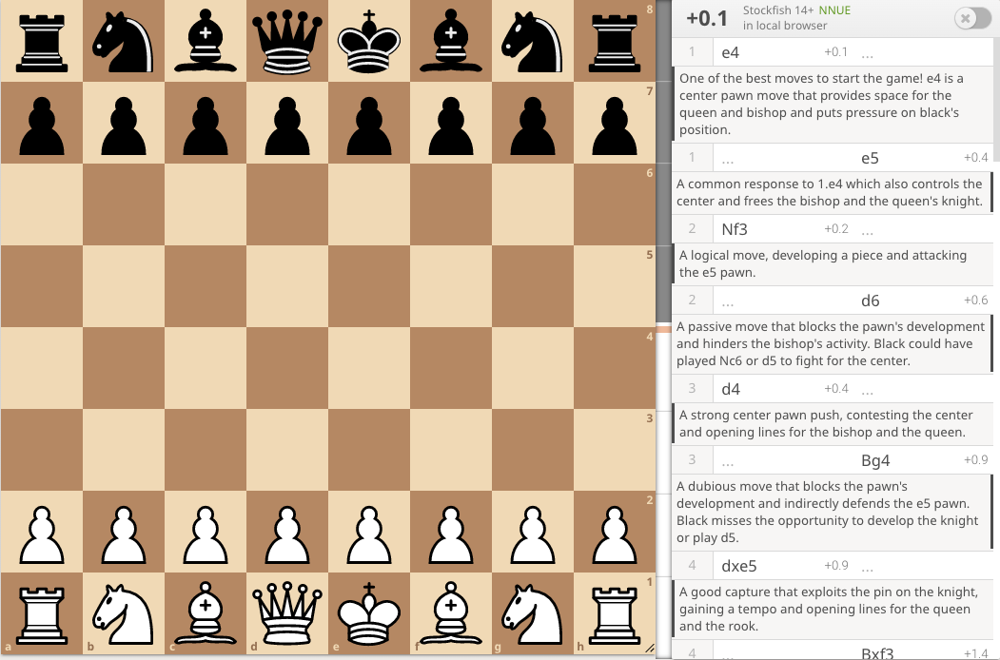
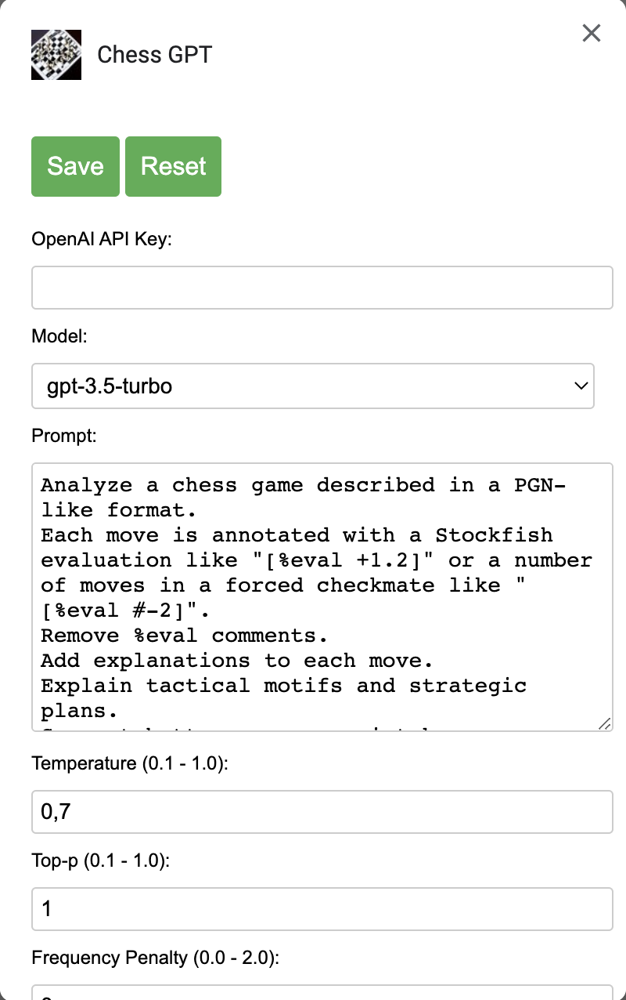
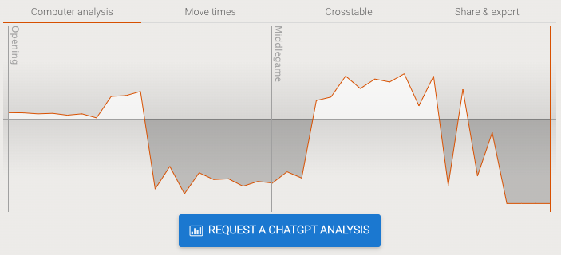

# ChessGPT

ChessGPT is a browser extension that allows users to analyze their chess games from Lichess using
OpenAI's ChatGPT language model.

## Installation

For Google Chrome:

1. Download [the latest release](https://github.com/miedzinski/chess-gpt/releases/download/v1.0.0/chess_gpt-1.0.zip).
2. Navigate to <chrome://extensions>.
3. Turn on "Developer mode".
4. Drop the .zip file anywhere.

## Configuration

1. Visit <chrome://extensions>.
2. Click on the ChessGPT details.
3. Scroll down and open "Extension options".

Before use, you must at least provide your OpenAI API key. You can generate one on
[the OpenAI website](https://platform.openai.com/account/api-keys).

## How to use

The extension is only available to Lichess users. Chess.com users can use
[one of the available extensions](https://github.com/califernication/lichessAnalysis) to export
the game to Lichess first.

To analyze the game, go to the game analysis page and click on the "Request a ChatGPT analysis"
button at the bottom under the "Computer analysis" tab.

## Issues

**The analysis is low quality.**

Unfortunately, language models are not the best chess players yet. While the analysis can
sometimes be surprisingly accurate, it is usually a bunch of nonsense written as a result of
the model's hallucinations.

In general, opting for a newer model yields better results. On top of that, you can try to tweak
the prompt and model parameters.

**The analysis doesn't cover the entire game.**

For longer games, it is possible that the model will reach the token limit before it finishes
analyzing the entire game. In particular, this can occur with GPT-3.5, which has the smallest
token limit. Try changing the model in the options to a newer model like GPT-4.

## License

GNU AGPLv3. See <LICENSE>.
